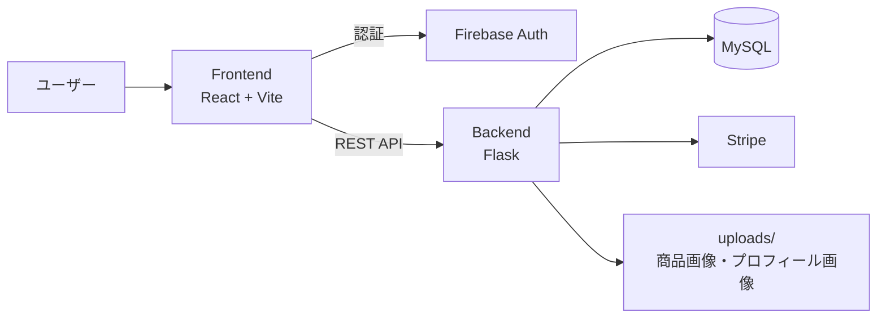
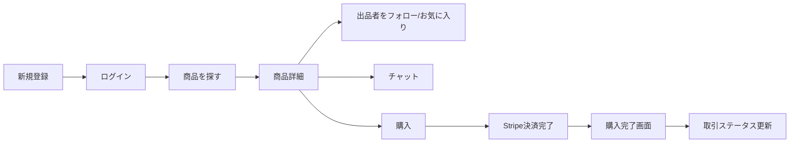

# Bibli 機能一覧図

## 1. システム構成

## 2. 機能ドメイン

```mermaid
flowchart TD
    A[Bibli]
    A --> B[認証・ユーザー]
    A --> C[商品売買]
    A --> D[コミュニティ]
    A --> E[通知・お知らせ]
    A --> F[設定]

    B --> B1[新規登録]
    B --> B2[ログイン]
    B --> B3[パスワード再設定]
    B --> B4[プロフィール表示/編集]

    C --> C1[商品検索/一覧]
    C --> C2[商品詳細]
    C --> C3[出品]
    C --> C4[お気に入り]
    C --> C5[商品チャット]
    C --> C6[Stripe決済]
    C --> C7[購入/配送ステータス更新]
    C --> C8[レコメンド]

    D --> D1[掲示板スレッド作成]
    D --> D2[コメント]
    D --> D3[いいね]
    D --> D4[ユーザーフォロー]
    D --> D5[ユーザーブロック]

    E --> E1[運営お知らせ]
    E --> E2[個人通知]
    E --> E3[通知既読化]

    F --> F1[通知設定]
    F --> F2[フォロー管理]
    F --> F3[ブロック管理]
```

## 3. 主要ユーザーフロー

## 4. 画面一覧（実装ベース）

| 画面 | ルート | 主機能 | 主なAPI |
|---|---|---|---|
| ホーム | `/` | 新着・おすすめ・フォローフィード表示 | `GET /api/products`, `GET /api/recommendations`, `GET /api/follow/feed` |
| ログイン | `/login` | Firebaseログイン | Firebase Auth |
| 新規登録 | `/register` | Firebase登録 + バックエンド登録 | `POST /api/register` |
| パスワード再設定 | `/forgot-password` | 再設定メール送信 | Firebase Auth |
| プロフィール | `/profile/:userId` | ユーザー情報・出品・購入履歴・お気に入り | `GET /api/profile/id/{user_id}`, `GET /api/products`, `GET /api/profile/{user_id}/favorites`, `GET /api/profile/{user_id}/purchases` |
| ユーザー設定 | `/user-settings` | プロフィール編集・画像更新 | `PUT /api/profile/{email}`, `POST /api/profile/{email}/image` |
| 設定 | `/settings` | 通知設定、フォロー/ブロック管理、ログアウト | `GET/PUT /api/notification-settings`, `GET /api/follow/list`, `GET /api/block/list`, `POST /api/unfollow`, `POST /api/unblock` |
| 検索結果 | `/search` | キーワード・価格・状態・並び替え検索 | `GET /api/products` |
| 商品詳細 | `/product-detail?id=` | 詳細、購入、フォロー、お気に入り、チャット、取引ステータス | `GET /api/products/{id}`, `POST/DELETE /api/favorites`, `POST /api/follow`, `POST /api/products/{id}/chat/messages`, `GET /api/products/{id}/purchase-status` |
| 出品 | `/products/listing` | 商品登録（画像複数・タグ） | `POST /api/products` |
| 出品完了 | `/products/listing-complete` | 出品完了表示 | 画面表示のみ |
| 購入確認 | `/checkout` | Stripe決済セッション作成 | `GET /api/products/{id}`, `POST /api/stripe/create-checkout-session` |
| 購入完了 | `/purchase-complete` | セッションから購入結果反映 | `GET /api/purchases/session/{session_id}` |
| 掲示板一覧 | `/forum` | スレッド一覧・絞り込み | `GET /api/forum/threads` |
| 掲示板投稿 | `/forum-post` | スレッド投稿 | `POST /api/forum/threads` |
| 掲示板詳細 | `/forum/:threadId` | スレッド詳細・コメント・いいね・フォロー | `GET /api/forum/threads/{id}`, `POST /api/forum/threads/{id}/comments`, `POST /api/forum/threads/{id}/like` |
| お知らせ一覧 | `/news` | 運営お知らせ + 個人通知 | `GET /api/news`, `GET /api/notifications`, `POST /api/notifications/read-all` |
| お知らせ詳細 | `/news-detail?id=` | お知らせ詳細表示 | `GET /api/news/{id}` |
| 情報ページ | `/contact`, `/terms`, `/privacy`, `/commercial` | 静的文面・問い合わせフォームUI | 基本は画面表示中心 |

## 5. データモデル（主要）

- `User`: ユーザー基本情報、プロフィール情報
- `Product`: 出品情報（タイトル、価格、状態、カテゴリ、販売状態）
- `ProductImage`: 商品画像（複数）
- `ProductTag`: 商品タグ
- `Purchase`: 購入履歴と取引状態
- `ProductChatMessage`: 商品ごとの当事者チャット
- `Favorite`: お気に入り
- `ForumThread`, `ForumComment`: 掲示板スレッド/コメント
- `ForumFollow`, `UserBlock`: フォロー/ブロック関係
- `Notification`, `UserNotificationSetting`: 通知と通知設定
